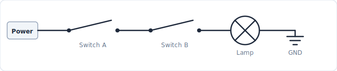
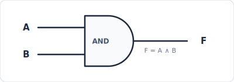
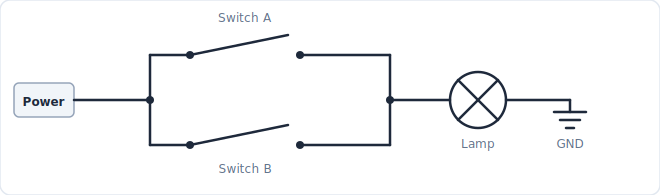
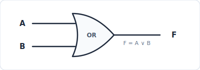
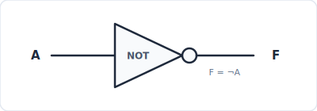

# Logic Gates

## Getting Started

For this lab, we will use [logic.ly](https://logic.ly/demo/) - a simulator that lets you build logic circuits by drag-and-drop in a web browser.

## 1. Boole and Shannon

### George Boole (1815–1864)

Boolean algebra is a mathematical system that treats true/false as 0 and 1, and logical connectives as operations on 0 and 1. The operators $\land$, $\lor$, and $\neg$ we use in class are the fundamental operations of this system.

### Claude Shannon (1916–2001)

In 1937, MIT graduate student Claude Shannon showed in his master's thesis *A Symbolic Analysis of Relay and Switching Circuits* that the logical operations of Boolean algebra correspond exactly to electrical switching circuits.

A logic gate is not just a truth table in the mind - it is a physical circuit implemented with real electronic components. Early gates used relays (electrically operated automatic switches); after the invention of the transistor in 1947, transistors took over; today they are integrated by the billions inside IC chips.

## 2. Logical Operations and Logic Circuits

Shannon's core insight is that the $\land$, $\lor$, and $\neg$ operations can be physically implemented using nothing more than wires and switches. AND is series, OR is parallel, NOT is inversion.

| Logical operation | Logic gate | Switch circuit    |
| ----------------- | ---------- | ----------------- |
| $\neg p$          | NOT        | State inversion   |
| $p \land q$       | AND        | Switches in series   |
| $p \lor q$        | OR         | Switches in parallel |

### AND

Thinking of AND as switches in series: current flows - and the lamp turns on - only when both switch A and switch B are closed. This behavior matches the truth table of $A \land B$ exactly.

When designing logic circuits, the AND gate is represented by the D-shaped symbol below.

#### Exercise

- (1) Build a circuit using an AND gate that takes two inputs and produces one output.

### OR

Thinking of OR as switches in parallel: current flows as long as at least one switch is closed. The logical expression is $A \lor B$.

When designing logic circuits, the OR gate is represented by the arrow-head-shaped symbol below.

#### Exercise

- (1) Build a circuit using an OR gate that takes two inputs and produces one output.

### NOT

NOT inverts the state of a switch. A relay - an electrically controlled automatic switch - can reverse its open/closed state. In logic circuit diagrams, NOT is represented as a triangle with a small circle (bubble) at its output.

#### Exercise

- (1) Build a circuit using a NOT gate that takes one input and produces one output.

## 3. Logic Gates

A logic gate is an electronic circuit that implements a logical operator. In addition to AND, OR, and NOT, the following gates are commonly used.

| Expression          | Gate name | Meaning                              |
| ------------------- | --------- | ------------------------------------ |
| $\neg(p \land q)$   | NAND      | Negation of AND - 1 if any input is 0 |
| $\neg(p \lor q)$    | NOR       | Negation of OR - 1 only when both inputs are 0 |
| $p \oplus q$        | XOR       | Exclusive OR - 1 when inputs differ  |

### XOR

XOR corresponds to the exclusive sense of "or" in everyday language. When someone says "choose coffee or tea," choosing both is usually not intended. The difference between $\lor$ (inclusive) and XOR (exclusive) can be verified directly with circuits.

XOR can be decomposed as follows, so it is always possible to build a circuit that produces the same output using only NOT, AND, and OR.

$$
p \oplus q \equiv (p \land \neg q) \lor (\neg p \land q)
$$

#### Exercise

- (1) Build a circuit using an XOR gate that takes two inputs and produces one output.
- (2) Build a circuit using only NOT, AND, and OR gates that produces the same output as an XOR gate.

### NAND

NAND alone can implement NOT, AND, and OR - making it a **universal gate**. NAND(A, A) gives NOT(A); NOT(NAND(A, B)) gives AND(A, B); NAND(NOT(A), NOT(B)) gives OR(A, B). (You may have heard the term *NAND flash memory* when shopping for external storage - the "NAND" there comes from this gate.)

By De Morgan's law, the following two expressions are logically equivalent, so the two corresponding circuits produce identical outputs.

$$
\neg(p \land q) \equiv \neg p \lor \neg q
$$

#### Exercise

- (1) Build a circuit using a NAND gate that takes two inputs and produces one output.
- (2) Build a circuit using NOT and AND that produces the same output as a NAND gate.
- (3) Build a circuit using NOT and OR that produces the same output as a NAND gate.
- (4) Build a NOT gate using only NAND gates.
- (5) Build an AND gate using only NAND gates.
- (6) Build an OR gate using only NAND gates.
- (7) *(Challenge)* Build a circuit equivalent to XOR using exactly four NAND gates.

## 4. From Truth Tables to Logical Expressions

Starting from a truth table, we can derive a logical expression and then build a logic circuit. Consider the following truth table as an example.

| $p$ | $q$ | $r$ | $F$ |
| --- | --- | --- | --- |
| 0   | 0   | 0   | 0   |
| 0   | 0   | 1   | 0   |
| 0   | 1   | 0   | 1   |
| 0   | 1   | 1   | 0   |
| 1   | 0   | 0   | 1   |
| 1   | 0   | 1   | 0   |
| 1   | 1   | 0   | 0   |
| 1   | 1   | 1   | 1   |

We can build a logical expression by locating the rows where $F = 1$. The procedure is:

- (1) Find all rows where $F = 1$.
- (2) Express each row as a conjunction ($\land$). Example: $(p=0, q=1, r=0)$ -> $\neg p \land q \land \neg r$
- (3) Connect all terms with $\lor$ to form the complete expression.
- (4) Build the logic circuit and verify that its outputs match the truth table.

## Exercises

### Exercise A. Natural Language -> Logical Expression -> Circuit

Use the following procedure for every problem.

- (1) Read the sentence and define propositional variables.
- (2) Identify the logical structure of the sentence and write a logical expression.
- (3) Build a truth table to verify that the expression captures the intended meaning.
- (4) Build the logic circuit and confirm that it matches the truth table.

**Example**

> "When the security system is active, an alarm sounds if the door or window is open."

- $A$ = security system active
- $D$ = door open
- $W$ = window open

$$
F = A \land (D \lor W)
$$

This requires one OR gate and one AND gate - two gates in total.

#### Problem A-1: Light Switch

> There are two switches, A and B. The room light turns on only when exactly one of the two switches is on.

- $A$: Switch A is on.
- $B$: Switch B is on.

#### Problem A-2: Alarm Condition

> An alarm sounds when the door is open and either a person is detected or it is nighttime.

- Define the variables.
- Write the logical expression and verify with a truth table.
- Build the logic circuit and verify with a truth table.

#### Problem A-3: Seatbelt Alert

> An alarm sounds if the door is open, or if the key is inserted and the seatbelt is not fastened.

- $D$: Door is open
- $K$: Key is inserted
- $B$: Seatbelt is fastened

#### Problem A-4: Seatbelt Alert (Extended)

> An alarm sounds when the driver or front passenger is seated, the ignition is on, and that occupant's seatbelt is not fastened.

- $D$: Driver is seated
- $P$: Front passenger is seated
- $I$: Ignition is on
- $B_d$: Driver's seatbelt is fastened
- $B_p$: Passenger's seatbelt is fastened

#### Problem A-5: Security System

> When the security system is active, an alarm sounds if the front door or a window is open.

- $A$: Security system active
- $D$: Front door open
- $W$: Window open

#### Problem A-6: Security System (Extended)

> When the security system is active, an alarm sounds if the front door or a window is open.
> Additional condition: even if the security system is off, the alarm always sounds if a window is broken.

- $A$: Security system active
- $D$: Front door open
- $W$: Window open
- $B$: Window broken

#### Problem A-7: Night Light

> When the night sensor is on, the light turns on if motion is detected or the manual switch is pressed.

- $N$: Night sensor on
- $M$: Motion detected
- $S$: Manual switch pressed

### Exercise B. Calculations

#### Problem B-1: Odd Parity

The logical expression that outputs true when an odd number of the three variables $p$, $q$, $r$ are true is:

$$
F = p \oplus q \oplus r
$$

- (1) Verify with a truth table.
- (2) Build the logic circuit.
- (3) How would you modify the circuit so that it outputs true when an *even* number of inputs are true?

#### Problem B-2: Equality Comparator

The logical expressions for $E = 1$ when $p$ and $q$ have the same truth value, and $D = 1$ when they differ, are:

$$
E = (\neg p \land \neg q) \lor (p \land q)
$$

$$
D = (\neg p \land q) \lor (p \land \neg q)
$$

- (1) Verify both expressions with a truth table.
- (2) Build the logic circuits.
- (3) Which connective is $D$ equivalent to?
- (4) Confirm that $E \equiv \neg D$.

#### Problem B-3: Half Adder

> Find the logical expressions for the sum $S$ and carry $C$ when adding two single-bit binary numbers $p$ and $q$.

Consider binary addition: $0+0=0$, $0+1=1$, $1+0=1$, $1+1=10_2$. In the last case the result is two digits wide, which is why we represent the output with two variables $S$ (sum) and $C$ (carry).

| $p$ | $q$ | $C$ (carry) | $S$ (sum) |
| --- | --- | ----------- | --------- |
| 0   | 0   | 0           | 0         |
| 0   | 1   | 0           | 1         |
| 1   | 0   | 0           | 1         |
| 1   | 1   | 1           | 0         |

This demonstrates that arithmetic addition can be performed using only logical operations - the starting point for how computers compute.

- (1) Derive the logical expression for each of $S$ and $C$.
- (2) Which connective does $S$ correspond to?
- (3) Which connective does $C$ correspond to?

#### Problem B-4: Three-Person Majority Vote

> Three people A, B, C vote yes (1) or no (0). A motion passes if at least two vote yes.

The logical expression for the outcome is:

$$
F = (A \land B) \lor (A \land C) \lor (B \land C)
$$

- (1) Verify with a truth table.
- (2) Build the logic circuit.

#### Problem B-5: Five-Person Majority Vote

> Among five voters A, B, C, D, E, a motion passes if at least three vote yes.

- (1) The truth table has $2^5 = 32$ rows. How many rows have $F = 1$?
- (2) Estimate how many terms the logical expression requires.
- (3) Consider how the complexity of the expression grows as the number of variables increases.
